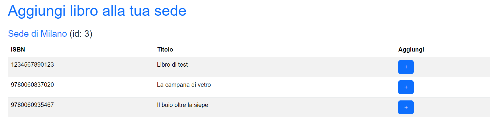
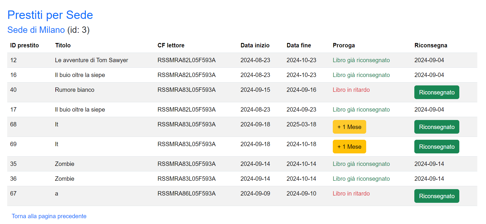

# DOCUMENTAZIONE TECNICA PROGETTO BASI DI DATI - INFORMATICA

> Federico Esposito - 18 Settembre 2024

<p align="center">
Documentazione tecnica progetto "Piattaforma per la gestione di una biblioteca" per il corso "Basi di dati (informatica)" (a.a. 2023-2024, appello di Settembre).
Realizzato da Federico Esposito (987540).
</p>
<p>Lo sviluppo del progetto è documentato in un apposito repository di Github al seguente <a href=https://github.com/espositofederico44/progetto-basi>link</a></p>

## Spiegazione folder

- **admin**: tutte le pagine relative agli utenti amministratori

- **bibliotecario**: tutte le pagine relative agli utenti bibliotecari

- **components**: pagine html (form, button, table ecc...)

- **conf**: i file di configurazione del database (nome, porta, utente, ecc ...) aggiunto al file .gitignore

- **docs**: la documentazione e il manuale utente

- **dump**: il dump del database

- **lettore**: tutte le pagine relative agli utenti lettori

- **lib**: si tratta di codice che viene fatto eseguire all'inizio della pagina html oppure di codice che viene eseguito con chiamate post.

- **sql**: le query (funzioni, viste, insert....) che ho usato per creare e popolare la basi di dati. Non vanno rieseguite singolarmente per ricreare il db perchè c'è già il dump. è solo per avere una visualizzazione più rapida e comoda (in vscode). Ma in caso di dubbi bisogna sempre far riferimento alla struttura dati effettiva che ci troviamo su postgre (es: usando dbeaver).

- **style**: il css personalizzato

## Schema concettuale (ER Schema)

Lo schema è stato disegnato usando <a href=https://draw.io>draw.io</a>.


### Ristrutturazione dello schema e considerazioni


- **Aggiunta di id per le entità che non hanno attributi identificativi.** Esempio: ho aggiunto un id all'entità autore perchè negli attributi nome, cognome, biografia, data di nascita, data di morte non c'è un modo per identificare univocamente un autore. Posso avere autori con lo stesso nome e cognome, la stessa data di nascita o di morte ecc... Anche per quanto riguarda i prestiti mi serve un attributo per referenziare le altre entità che coinvolge.

- **Gerararchia di generalizzazione:**

  - _Totale_: ogni entità appartenente alla classe generale deve appartenere a una delle classi specifiche. Questo implica che non esiste un'entità che appartenga solo alla superclasse senza essere anche associata a una delle sottoclassi. Infatti un utente deve essere o bibliotecario o lettore o admin. Non può essere "solo un utente".
  - _Esclusiva_: quando un'entità può appartenere a una sola sottoclasse tra quelle derivate dalla classe generale. Questo significa che un'entità non può appartenere contemporaneamente a più sottoclassi. Un utente non può essere sia admin sia bibliotecario.

  Tutti gli utenti sono dotati di nome, cognome, cf (usato assieme a una password che ho aggiunto per il login). Ho deciso di accorpare queste informazioni nella entità padre utenti. Quindi sono presenti 4 tabelle: utenti, admin, biblitecario, lettore. Ogni utente è memorizzato nella tabella principale utenti, mentre le altre tabelle (bibliotecario, lettore, admin) specializzano gli utenti in base al loro ruolo specifico.

- **Collegamento libro e autore**:
  La relazione fra libro e autore (scritto) è una molti-a-molti. Un libro può essere scritto da più di un autore e un autore può aver scritto più libri. Ho gestito questa relazione con una tabella che ha come chiave primaria la combinazione delle chiavi di libro e autore.

- **Collegamento bibliotecario e sede**:
  La relazione fra bibliotecario e sede (lavora) è una uno-a-molti. Un bibliotecario può lavorare in una sola sede e in una sede possono lavorare più bibliotecari. La tabella bibliotecario ha un attributo aggiuntivo che ha come chiave esterna l'id della sede. (stessa cosa per comune e provincia: una sede ha un solo comune ma un comune può avere più sede, un comune ha una sola provincia ma una provincia ha più comuni)

- **Collegamento catalogo e prestiti**: Una copia specifica di un libro è identificata da un ID catalogo e sarà l'identificativo che deve usare la relazione prestiti per riferirsi a una determinata copia di libro in una determinata sede.

### Visualizzazione da Dbeaver


## Schema logico (Logical Schema)

Le chiavi primarie sono riportate **grassetto**.  
Le chiavi esterne sono riportate _sottolineate_ e viene indicato con due puntini : la tabella cui fa riferimento.

- **utenti** (**cf**, cognome, nome, tipo, password)
- **admin** (**_cf_** : _utenti_)
- **bibliotecario** (**_cf_** : _utenti_, _sede_ : _sedi_)
- **lettore** (**_cf_** : _utenti_, categoria, ritardi)
- **province** (**sigla**, nome)
- **autori** (**id**, nome, cognome, biografia, data_nascita, data_morte)
- **libri** (**isbn**, titolo, trama)
- **catalogo** (**id**, _sede_ : _sedi_, _isbn_ : _libri_)
- **scritto** (**_id_autore_**, **_isbn_libro_**, _id_autore_ : _autori_, _isbn_libro_ : _libri_)
- **comuni** (**id**, nome, _provincia_ : _province_)
- **prestiti** (**id**, _cf_lettore_ : _lettore_, _id_catalogo_ : _catalogo_, data_inizio, data_fine, data_riconsegna)

### Uso di tipi di dato particolari

`tipo_utenti` indica la tipologia degli utenti. I valori inseriti sono i ruoli che un utente può avere.

```sql
CREATE type tipo_utenti AS ENUM (
    'admin',
    'bibliotecario',
    'lettore'
);
```

`tipo_lettore` indica la tipologia del lettore. I valori inseriti sono i due che un lettore può avere.

```sql
CREATE type tipo_lettore AS ENUM (
    'base',
    'premium'
);
```

## Composizione pagina

Al fine di aumentare la riusabilità e la modularità una pagina php non viene mai inserito codice ma solo riferimenti ad altri file. In particolare ogni pagina ingloba 4 file.
Vediamo un esempio.

```php
<?php require '../lib/allbooks.php'; ?>
<?php require '../components/head.php'; ?>
<body>
  <?php require '../components/tableallbooks.php'; ?>
  <?php require '../components/footer.php'; ?>
</body>
```

1. contiene il codice per:

   - avviare la sessione
   - includere functions.php
   - fare i controlli relativi alla tipologia utente (es: ci sono funzionalità accessibili solo da un bibliotecario quindi se un lettore scoprisse come è strutturato il file system delle pagine del bibliotecario potrebbe fare determinate operazioni non previste per il suo ruolo ma questi controlli sulla sessione lo impediscono)
   - una variabile con indicato il titolo della pagina (es: Visualizza tutti i libri)

2. contiene html di base che possiedono tutte le pagine

   - titolo della pagina
   - setting per un sito responsive
   - riferimenti a bootstrap
   - riferimenti a css personalizzato

3. contiene la funzionalità effettiva della pagina.

4. contiene informazioni aggiuntive sul progetto

## Navigazione pagine

Un utente al suo login vede le pagine php della cartella in base al tipo (bibliotecario -> vede le pagine dentro bibliotecario). In quella zona i file non sono organizzati in ordine gerarchio e per questa motivazione non ho ritenuto opportuno inserire una navbar. In ogni pagina per tornare alla dashboard (index.php) c'è un pulsante.
Inoltre in ogni pagina viene avviata una sessione e verificata la presenza di un utente loggato, reindirizzando alla pagina di login se non lo è.

## Elenco funzioni php

sotto `/lib/functions.php` per i dettagli.

- **addAuthor**: Aggiunge un nuovo autore.
- **addBook**: Aggiunge un nuovo libro.
- **addBookInYourBranch**: Aggiunge un libro al catalogo di una sede.
- **addBranch**: Aggiunge una nuova sede.
- **addLoan**: Aggiunge un prestito per un lettore se il libro è disponibile.
- **availableBranches**: Mostra le sedi disponibili per un bibliotecario specifico e fa selezionare una sede.
- **changePassword**: Cambia la password di un utente.
- **collegaAutoreLibro**: Collega un autore a un libro nel database utilizzando l'ID dell'autore e l'ISBN del libro.
- **connectDb**: Connette al database.
- **closeDb**: Chiude la connessione al database.
- **deleteAuthor**: Elimina un autore.
- **deleteBook**: Elimina un libro.
- **deleteBranch**: Elimina una sede.
- **deleteLinkAuthorBook**: Toglie un collegamento fra un autore e un libro.
- **fetchAuthorById**: Recupera le informazioni di un autore dato il suo ID.
- **fetchAuthors**: Recupera la lista di autori.
- **fetchBookByIsbn**: Recupera le informazioni di un libro dato il suo ISBN.
- **fetchBooks**: Recupera la lista dei libri.
- **fetchBranchById**: Recupera le informazioni di una sede dato il suo ID.
- **fetchBranches**: Recupera tutte le sedi.
- **generateCard**: Genera l'HTML per una card Bootstrap con un titolo e un link.
- **getActiveLoans**: Restituisce i prestiti attivi di un lettore dato il suo codice fiscale.
- **getAvailableBranches**: Restituisce le sedi in cui è disponibile un determinato libro.
- **getBranchStats**: Recupera le statistiche della sede.
- **getCatalogBySede**: Recupera il catalogo dei libri di una sede utilizzando l'ID della sede.
- **getComuneIdByName**: Ottiene l'ID di un comune in base al suo nome.
- **getLettoriConRitardi**: Restituisce l'elenco dei lettori e il numero di ritardi.
- **getOverdueBooksByBranch**: Recupera i libri in ritardo di una sede.
- **getPrestitiPerSede**: Restituisce i prestiti associati alla sede di un bibliotecario.
- **getReturnedLoans**: Restituisce i prestiti restituiti di un lettore.
- **getSedeById**: Recupera le informazioni di una sede specifica.
- **getSedi**: Recupera solo nome e id delle sedi.
- **isBookAvailable**: Verifica se un libro è disponibile (cioè se non ci sono prestiti attivi).
- **linkUserBranches**: Collega un bibliotecario a una sede.
- **loginUser**: Gestisce il login di un utente.
- **registerUser**: Registra un nuovo utente nel sistema.
- **resetReaderDelays**: Azzera i ritardi di un lettore.
- **searchBooks**: Cerca i libri in base al titolo.
- **searchComune**: Cerca i comuni in base al nome.
- **showCatalog**: Mostra il catalogo di libri associato alla sede di un bibliotecario.
- **showTableScritto**: Mostra i collegamenti fra autori e libro.
- **updateAuthor**: Aggiorna le informazioni di un autore.
- **updateBook**: Aggiorna i dettagli di un libro.
- **updateBranch**: Aggiorna le informazioni di una sede.
- **yourBranch**: Restituisce l'ID e il nome della sede associata a un bibliotecario.

## Elenco procedure PostgreSQL

sotto `/sql/procedures.sql` per i dettagli.

- **add_author**: Inserisce un nuovo autore nella tabella "autori" con nome, cognome, data di nascita e, opzionalmente, data di morte e biografia.
- **add_book**: Aggiunge un nuovo libro nella tabella "libri" con ISBN, titolo e trama.
- **add_book_to_branch**: Inserisce un libro in una sede aggiungendo una riga nella tabella "catalogo".
- **add_branch**: Aggiunge una nuova sede nella tabella "sedi" con nome, indirizzo, CAP e ID del comune.
- **add_loan**: Aggiunge un prestito di un libro per un lettore. Inserisce i dettagli del prestito nella tabella "prestiti" con le date di inizio e fine.
- **azzera_ritardi_lettore**: Resetta il numero di ritardi di un lettore.
- **collega_autore_libro**: Collega un autore a un libro inserendo un record nella tabella "scritto", che associa l'ID dell'autore con l'ISBN del libro.
- **controlla_ritardo_e_aggiorna**: Controlla se un libro è stato restituito in ritardo e, in caso affermativo, incrementa il numero di ritardi del lettore nella tabella "lettore".
- **delete_author_by_id**: Elimina un autore.
- **delete_book_by_isbn**: Elimina un libro.
- **delete_branch**: Elimina una sede.
- **elimina_scritto**: Toglie un collegamento fra un autore e un libro.
- **link_user_branches**: Collega un bibliotecario a una sede.
- **proroga_prestito**: Aumenta di un mese la data di fine prestito
- **riconsegna_prestito**: Inserisci la data di oggi come data di consegna.
- **update_author_by_id**: Aggiorna i dettagli di un autore.
- **update_book_by_isbn**: Aggiorna i dettagli di un libro.
- **update_branch**: Aggiorna i dettagli di una sede.

## Elenco funzioni PostgreSQL

sotto `/sql/functions.sql` per i dettagli.

- **aggiorna_viste_materializzate**: Aggiorna le viste materializzate per statistiche delle sedi e libri in ritardo, richiamata tramite trigger.
- **available_branches**: Restituisce le sedi disponibili per un bibliotecario.
- **check_max_prestiti**: Verifica se un lettore ha raggiunto il numero massimo di prestiti consentiti in base alla sua categoria.
- **fetch_author_by_id**: Recupera le informazioni di un autore dato il suo ID.
- **fetch_authors**: Recupera la lista di autori.
- **fetch_book_by_isbn**: Restituisce i dettagli di un libro dato il suo ISBN.
- **fetch_books**: Restituisce la lista di libri.
- **fetch_branch_by_id**: Restituisce le informazioni di una sede dato il suo ID.
- **fetch_branches**: Recupera tutte le sedi.
- **get_active_loans**: Restituisce i prestiti attivi di un lettore.
- **get_all_sedi**: Recupera l'elenco di tutte le sedi nel database (solo id e nome).
- **get_available_branches_by_isbn**: Restituisce le sedi in cui è disponibile un libro.
- **get_branch_by_cf**: Restituisce l'ID e il nome della sede associata a un bibliotecario.
- **get_catalog_by_id_sede**: Restituisce il catalogo di una sede.
- **get_catalogo_non_raggruppato**: Restituisce il catalogo di una sede senza raggruppamento.
- **get_comune_id_by_name**: Restituisce l'ID di un comune.
- **get_lettori_con_ritardi**: Restituisce un elenco di lettori con ritardi e il loro numero.
- **get_prestiti_per_sede**: Restituisce tutti i prestiti associati alla sede.
- **get_returned_loans**: Restituisce i prestiti già restituiti di un lettore.
- **get_sede_by_id**: Restituisce le informazioni di una sede specifica.
- **get_scritto**: Restituisce la tabella con i collegamenti fra autori e libri.
- **is_book_available**: Verifica se un libro è disponibile.
- **search_books_by_title**: Cerca libri in base al titolo e restituisce ISBN.
- **search_comune**: Cerca i comuni in base al nome.
- **show_catalog_by_cf**: Restituisce il catalogo dei libri associati a una sede.
- **trigger_limita_prestiti**: Limita l'inserimento di un nuovo prestito, verificando che non sia stato raggiunto il limite massimo di prestiti per il lettore.
- **verifica_ritardi**: Verifica il numero di ritardi di un lettore prima di permettere nuove operazioni di prestito, bloccandolo se supera 5 ritardi.

## Elenco trigger PostgreSQL

sotto `/sql/trigger.sql` per i dettagli e nei requisti la spiegazione

- **limita_prestiti_trigger**

- **trigger_verifica_ritardi**

- **trigger_aggiorna_viste_catalogo**

- **trigger_aggiorna_viste_prestiti**

## Elenco materialized view PostgreSQL

sotto `/sql/view.sql` per i dettagli e nei requisti la spiegazione

- **vista_sede_statistiche**

- **vista_libri_ritardo**

## Requisiti

### 1. Blocco prestiti a lettori ritardatari

Ho gestito questa funzionalità con il trigger `trigger_verifica_ritardi`. Questo trigger esegue la funzione `verifica_ritardi` che controlla se il numero di ritardi è 5. In caso positivo restituisce un messaggio e non viene permesso di continuare con l'operazione. In caso negativo continua l'inserimento del prestito.

```sql
CREATE TRIGGER trigger_verifica_ritardi
BEFORE INSERT ON prestiti
FOR EACH ROW
EXECUTE FUNCTION verifica_ritardi();
```

```sql
CREATE OR REPLACE FUNCTION verifica_ritardi()
RETURNS TRIGGER AS $$
BEGIN
    -- Controlla il numero di ritardi del lettore
    IF (SELECT ritardi FROM lettore WHERE cf = NEW.cf_lettore) > 4 THEN
       RAISE NOTICE 'Il lettore con codice fiscale % ha più di 5 ritardi attivi.', NEW.cf_lettore;
       RETURN NULL;
    END IF;

    RETURN NEW;
END;
$$ LANGUAGE plpgsql;
```

### 2. Numero massimo di prestiti

I lettori di categoria base possono avere al massimo 3 volumi in prestito allo stesso tempo, mentre i lettori di categoria premium possono averne al massimo 5.

Ho gestito questa funzionalità con il trigger `limita_prestiti_trigger`. Il trigger viene eseguito prima di ogni inserimento nella tabella prestiti. Questo trigger esegue la funzione `trigger_limita_prestiti` che fai un controllo sul valore in uscita dalla funzione `check_max_prestiti`.
Questa ultima funzione verifica se un lettore ha raggiunto il numero massimo di prestiti consentiti in base alla sua categoria (base o premium) e restituisce TRUE se il lettore può prendere in prestito un altro libro. Se la funzione `check_max_prestiti` restituisce FALSE, l'inserimento viene bloccato e viene lanciato un messaggio di errore. Ho separato la funzione del trigger dalla funzione del controllo dei prestiti per aumentare la modularità del codice.

```sql
CREATE OR REPLACE FUNCTION check_max_prestiti(cf_lett VARCHAR(16))
RETURNS BOOLEAN AS $$
DECLARE
    categoria tipo_lettore;
    prestiti_correnti INTEGER;
    max_prestiti INTEGER;
BEGIN
    -- Recupera la categoria del lettore
    SELECT l.categoria INTO categoria
    FROM lettore l
    WHERE l.cf = cf_lett;

    -- Conta i prestiti correnti (non restituiti)
    SELECT COUNT(*) INTO prestiti_correnti
    FROM prestiti p
    WHERE p.cf_lettore = cf_lett AND p.data_riconsegna IS NULL;

    -- Definisce il numero massimo di prestiti in base alla categoria
    IF categoria = 'base' THEN
        max_prestiti := 3;
    ELSIF categoria = 'premium' THEN
        max_prestiti := 5;
    ELSE
        RAISE EXCEPTION 'Categoria non valida';
    END IF;

    -- Verifica se il numero massimo di prestiti è stato raggiunto
    IF prestiti_correnti >= max_prestiti THEN
        RETURN FALSE;
    ELSE
        RETURN TRUE;
    END IF;
END;
$$ LANGUAGE plpgsql;
```

```sql
CREATE OR REPLACE FUNCTION trigger_limita_prestiti()
RETURNS TRIGGER AS $$
BEGIN
    -- Verifica il numero massimo di prestiti prima di inserire un nuovo prestito
    IF NOT check_max_prestiti(NEW.cf_lettore) THEN
        RAISE NOTICE 'Numero massimo di prestiti raggiunto per questo lettore: %', NEW.cf_lettore;
        RETURN NULL;
    END IF;

    RETURN NEW;
END;
$$ LANGUAGE plpgsql;
```

```sql
CREATE TRIGGER limita_prestiti_trigger
BEFORE INSERT ON prestiti
FOR EACH ROW
EXECUTE FUNCTION trigger_limita_prestiti();
```

### 3. Ritardi nelle restituzioni.

Un libro è considerato riconsegnato quando data_riconsegna assume il valore di una data.

```sql
CREATE OR REPLACE PROCEDURE riconsegna_prestito(
    p_id_prestito INTEGER,
    p_data_riconsegna DATE
)
LANGUAGE plpgsql
AS $$
BEGIN
    UPDATE prestiti
    SET data_riconsegna = p_data_riconsegna
    WHERE id = p_id_prestito AND data_riconsegna IS NULL;
END;
$$;
```

Questa procedura controllerà se il libro è stato restituito in ritardo e aggiornerà il contatore dei ritardi del lettore. Viene invocata dopo aver eseguito la funzione di riconsegna prestito.

```sql
CREATE OR REPLACE PROCEDURE controlla_ritardo_e_aggiorna(p_id_prestito INTEGER)
RETURNS VOID AS $$
DECLARE
    v_cf_lettore VARCHAR(16);
    v_data_fine DATE;
    v_data_riconsegna DATE;
BEGIN
    SELECT p.cf_lettore, p.data_fine, p.data_riconsegna
    INTO v_cf_lettore, v_data_fine, v_data_riconsegna
    FROM prestiti p
    WHERE p.id = p_id_prestito;

    -- Verifica se la data di riconsegna è maggiore della data di fine (ritardo)
    IF v_data_riconsegna > v_data_fine THEN
        -- Aggiorna il contatore dei ritardi del lettore
        UPDATE lettore
        SET ritardi = ritardi + 1
        WHERE cf = v_cf_lettore;
    END IF;
END;
$$ LANGUAGE plpgsql;
```

La riconsenga viene gestita tramite una chiamata POST, dopo aver eseguito l'inserimento del prestito si chiama la procedura per il conteggio dei ritardi.

```php
if ($_SERVER['REQUEST_METHOD'] == 'POST' && isset($_POST['riconsegna'])) {
  $id_prestito = $_POST['id_prestito'];
  $data_riconsegna = date('Y-m-d');
  $db = connectDb();

  $sql_riconsegna = "CALL riconsegna_prestito($1, $2)";
  $result_riconsegna = pg_prepare($db, "riconsegna_prestito", $sql_riconsegna);
  $result_riconsegna = pg_execute($db, "riconsegna_prestito", [$id_prestito, $data_riconsegna]);

  if ($result_riconsegna) {
    // Successo nella riconsegna, ora controlla il ritardo e aggiorna
    $sql_controlla_ritardo = "CALL controlla_ritardo_e_aggiorna($1)";
    $result_controlla_ritardo = pg_prepare($db, "controlla_ritardo_e_aggiorna", $sql_controlla_ritardo);
    $result_controlla_ritardo = pg_execute($db, "controlla_ritardo_e_aggiorna", [$id_prestito]);

    if ($result_controlla_ritardo) {
      $_SESSION['message'] = "Prestito riconsegnato correttamente e stato di ritardo aggiornato.";
    } else {
      $_SESSION['error'] = "Errore durante l'aggiornamento del ritardo.";
    }
  } else {
    $_SESSION['error'] = "Errore durante la riconsegna del prestito.";
  }

  closeDb($db);
}
```

### 4. Disponibilità dei volumi.

Posso andare su Mostra catalogo per visualizzare i libri in totale (usando count(\*) conto sia quelli disponibili e non disponibili) e quelli disponibili (sottraggo dal totale i prestiti attivi cioè senza data di riconsenga).`COALESCE` Viene usato per gestire i casi in cui non ci siano prestiti (evitando di restituire un valore NULL): in quei casi il conteggio dei prestiti in corso sarà 0 evitando che la sottrazione dia errori. Filtro i risultati per mostrare solo i libri presenti nella sede in cui lavora il bibliotecario e non tutto il catalogo.

```sql
CREATE OR REPLACE FUNCTION show_catalog_by_cf(_cf varchar)
RETURNS TABLE (
    titolo varchar(255),
    isbn varchar(13),
    num_copie integer,
    disponibili integer
)
LANGUAGE plpgsql
AS $$
BEGIN
    RETURN QUERY
    SELECT l.titolo,
           c.isbn,
           COUNT(*)::integer as num_copie,  -- Numero di copie totale
           (COUNT(*) - COALESCE(
               (SELECT COUNT(*)
                FROM prestiti p
                JOIN catalogo c2 ON p.id_catalogo = c2.id
                WHERE c2.isbn = c.isbn
                AND p.data_riconsegna IS NULL), 0))::integer as disponibili  -- Copie disponibili
    FROM catalogo c
    JOIN sedi s ON c.sede = s.id
    JOIN libri l ON c.isbn = l.isbn
    JOIN bibliotecario b ON s.id = b.sede
    WHERE b.cf = _cf
    GROUP BY c.isbn, l.titolo;
END;
$$;
```

Quando un lettore richiede un prestito prima di confermarlo viene chiamata questa funzione che verifica che il libro sia disponibili (non ci sono prestiti attivi)

```sql
CREATE OR REPLACE FUNCTION is_book_available(_id_catalogo integer)
RETURNS boolean
LANGUAGE plpgsql
AS $$
DECLARE
    prestiti_attivi integer;
BEGIN
    SELECT COUNT(*)
    INTO prestiti_attivi
    FROM prestiti p
    WHERE p.id_catalogo = _id_catalogo
      AND p.data_riconsegna IS NULL;

       IF prestiti_attivi > 0 THEN
        RETURN false;
    ELSE
        RETURN true;
    END IF;
END;
$$;
```

### 5. Proroga della durata di un prestito.

Nella colonna Proroga ho 3 casi:

- Pulsante +1 mese (libro non in ritardo e non riconsegnato)
- Messaggio 'Libro in ritardo' (libro non in ritardo e non riconsegnato, niente proroga)
- Messaggio 'Libro riconsegnato' (libro riconsegnato, niente proroga)

Questi 3 controlli sono fatti con php

```php
if ($data_riconsegna): ?>
<span class="text-success">Libro già riconsegnato</span>
<?php elseif ($today > $data_fine): ?>
<span class="text-danger">Libro in ritardo</span>
<?php else: ?>
<form method="post" action="">
    <input type="hidden" name="id_prestito" value="<?= htmlspecialchars($prestito['id']) ?>">
    <button type="submit" name="proroga" class="btn btn-warning">+ 1 Mese</button>
</form>
<?php endif; ?>
```

Procedura che permette di prorogare un prestito. Aggiungo un mese a data fine.

```sql
CREATE OR REPLACE PROCEDURE proroga_prestito(id_prestito INTEGER)
LANGUAGE plpgsql
AS $$
BEGIN
    UPDATE prestiti
    SET data_fine = data_fine + INTERVAL '1 month'
    WHERE id = id_prestito AND data_riconsegna IS NULL;
END;
$$;
```

Il pulsante per la proroga prestito è gestito tramite post.

```php
if ($_SERVER['REQUEST_METHOD'] == 'POST' && isset($_POST['proroga'])) {
  $id_prestito = $_POST['id_prestito'];

  $db = connectDb();

  $sql_proroga = "CALL proroga_prestito($1)";
  $result_proroga = pg_prepare($db, "proroga_prestito", $sql_proroga);
  $result_proroga = pg_execute($db, "proroga_prestito", [$id_prestito]);

  if ($result_proroga) {
    $_SESSION['message'] = "Prestito prorogato di 1 mese.";
  } else {
    $_SESSION['error'] = "Errore durante la proroga del prestito.";
  }

  closeDb($db);
}
```

### 6. Selezione della sede.

Un bibliotecario prima di gestire i prestiti deve prima scegliere una sede. Di seguito la funzione che permette a un bibliotecario di scegliere la sede dove lavorare

```php
function availableBranches($cf_bibliotecario)
{
    $db = connectDb();
    $message = '';

    $sql = "SELECT * FROM available_branches($1)";
    $result = pg_prepare($db, "available_branches", $sql);
    $result = pg_execute($db, "available_branches", [$cf_bibliotecario]);

    if (!$result) {
        $message = "Errore durante l'esecuzione della query: " . pg_last_error($db);
        closeDb($db);
        return $message;
    }

    // Loop sui risultati e crea le righe della tabella
    while ($row = pg_fetch_assoc($result)) {
        echo '<tr>';
        echo '<td>' . htmlspecialchars($row['nome']) . '</td>';

        if ($row['cf'] === $cf_bibliotecario) {
            echo '<td><em>Hai scelto questa sede</em></td>';
        } else {
            echo '<td><form method="post" action=""><button type="submit" class="btn btn-primary" name="sede_id" value="' . htmlspecialchars($row['id']) . '">Scegli questa sede</button></form></td>';
        }

        echo '</tr>';
    }

    closeDb($db);
}
```

```sql
CREATE OR REPLACE FUNCTION available_branches(p_cf_bibliotecario varchar)
RETURNS TABLE(
    id integer,
    nome VARCHAR(100),
    cf VARCHAR(16)
)
LANGUAGE plpgsql
AS $$
BEGIN
    RETURN QUERY
    SELECT s.id, s.nome, b.cf
    FROM sedi AS s
    LEFT JOIN bibliotecario AS b
    ON s.id = b.sede AND b.cf = p_cf_bibliotecario;
END;
$$;
```

Il lettore prima sceglie un libro
searchBooks($title)

```sql
CREATE OR REPLACE FUNCTION search_books_by_title(_title text)
RETURNS TABLE (
    isbn varchar(13),
    titolo varchar(255)
)
LANGUAGE plpgsql
AS $$
BEGIN
    RETURN QUERY
    SELECT l.isbn, l.titolo::VARCHAR(255)
    FROM libri l
    WHERE l.titolo ILIKE '%' || _title || '%';
END;
$$;
```

....Successivamente può scegliere la sede dove prenotarlo......
getAvailableBranches($isbn)

```sql
CREATE OR REPLACE FUNCTION get_available_branches_by_isbn(_isbn varchar(13))
RETURNS TABLE (
    id integer,
    nome varchar(50),
    indirizzo varchar(255)
)
LANGUAGE plpgsql
AS $$
BEGIN
    RETURN QUERY
    SELECT c.id, s.nome, s.indirizzo
    FROM catalogo c
    JOIN sedi s ON c.sede = s.id
    WHERE c.isbn = _isbn;
END;
$$;
```

.........Viene controllato se il libro è disponibile con un boolean......
isBookAvailable($id_catalogo)

```sql
CREATE OR REPLACE FUNCTION is_book_available(_id_catalogo integer)
RETURNS boolean
LANGUAGE plpgsql
AS $$
DECLARE
    prestiti_attivi integer;
BEGIN
    SELECT COUNT(*)
    INTO prestiti_attivi
    FROM prestiti p
    WHERE p.id_catalogo = _id_catalogo
      AND p.data_riconsegna IS NULL;

       IF prestiti_attivi > 0 THEN
        RETURN false;
    ELSE
        RETURN true;
    END IF;
END;
$$;
```

Se è tutto ok parte l'insierimento nella tabella prestiti.
addLoan($cf_lettore, $id_catalogo)

```sql
CREATE OR REPLACE PROCEDURE add_loan(
    _cf_lettore varchar(16),
    _id_catalogo integer,
    _data_inizio date,
    _data_fine date
)
LANGUAGE plpgsql
AS $$
BEGIN
    -- Verifica se il libro è disponibile
    IF (SELECT is_book_available(_id_catalogo)) THEN
        -- Inserisce il prestito nella tabella 'prestiti'
        INSERT INTO prestiti (cf_lettore, id_catalogo, data_inizio, data_fine)
        VALUES (_cf_lettore, _id_catalogo, _data_inizio, _data_fine);
    ELSE
        -- Se il libro non è disponibile, solleva un'eccezione
        RAISE EXCEPTION 'Il libro non è disponibile per il prestito.';
    END IF;
END;
$$;
```

### 7. Statistiche per ogni sede

Queste statistiche vengono visualizzate nella pagina statistichesede.php. Dato che nella tabella catalogo sono riportati i libri di tutte le sede ho inserito un filtro (WHERE sede = :sede) che visualizza solo i libri/prestiti della sede del bibliotecario interessato. La sede del bibliotecario viene recuperata con la funzione $sede = yourBranch($\_SESSION['user']);. Successivamente la funzione php recupera i dati dalla vista materializzata.

```php
function getBranchStats($sede_id)
{
    $db = connectDb();

    $sql = "SELECT * FROM vista_sede_statistiche WHERE sede = $1";
    $result = pg_prepare($db, "get_branch_stats", $sql);
    $result = pg_execute($db, "get_branch_stats", [$sede_id]);

    if (!$result) {
        echo "Errore nel recupero delle statistiche della sede: " . pg_last_error($db);
        closeDb($db);
        return false;
    }

    $stats = pg_fetch_assoc($result);

    closeDb($db);
    return $stats;
}
```

**Considerazioni sulla vista materializzata:** Ho usato 2 CTE catalogo statistiche e prestiti statistiche per differenziare il conteggio da una parte nella tabella catalogo e nella tabella prestiti. COALESCE gestisce i casi in cui non ci siano risultato da visualizzare.

```sql
CREATE MATERIALIZED VIEW vista_sede_statistiche AS
WITH catalogo_statistiche AS (
    -- Conteggi dalla tabella catalogo
    SELECT
        sede,
        COUNT(isbn) AS numero_totale_copie_gestite,
        COUNT(DISTINCT isbn) AS numero_totale_isbn_gestiti
    FROM catalogo
    GROUP BY sede
),
prestiti_statistiche AS (
    -- Conteggi dalla tabella prestiti associati alla sede tramite catalogo
    SELECT
        c.sede,
        COUNT(CASE WHEN p.data_riconsegna IS NULL THEN 1 END) AS numero_prestiti_in_corso,
        COUNT(CASE WHEN p.data_riconsegna IS NOT NULL THEN 1 END) AS numero_prestiti_conclusi,
        COUNT(p.id) AS numero_totale_prestiti
    FROM
        prestiti p
    INNER JOIN
        catalogo c ON c.id = p.id_catalogo  -- Uniamo i prestiti alla sede tramite catalogo
    GROUP BY
        c.sede
)
-- Unione dei risultati
SELECT
    c.sede,
    c.numero_totale_copie_gestite,
    c.numero_totale_isbn_gestiti,
    COALESCE(p.numero_prestiti_in_corso, 0) AS numero_prestiti_in_corso,
    COALESCE(p.numero_prestiti_conclusi, 0) AS numero_prestiti_conclusi,
    COALESCE(p.numero_totale_prestiti, 0) AS numero_totale_prestiti
FROM
    catalogo_statistiche c
LEFT JOIN
    prestiti_statistiche p ON c.sede = p.sede;
```

Una vista viene aggiornata grazie a un trigger ad ogni inserimento, modifica, cancellazione delle tabelle catalogo, ritardi.

```sql
-- Funzione che aggiorna le view, verrà poi richiamata dai trigger
CREATE OR REPLACE FUNCTION aggiorna_viste_materializzate()
RETURNS TRIGGER AS $$
BEGIN
    -- Aggiorna entrambe le viste materializzate
    REFRESH MATERIALIZED VIEW vista_sede_statistiche;
    REFRESH MATERIALIZED VIEW vista_libri_ritardo;
    RETURN NULL;
END;
$$ LANGUAGE plpgsql;

CREATE TRIGGER trigger_aggiorna_viste_catalogo
AFTER INSERT OR UPDATE OR DELETE
ON catalogo
FOR EACH STATEMENT
EXECUTE FUNCTION aggiorna_viste_materializzate();

CREATE TRIGGER trigger_aggiorna_viste_prestiti
AFTER INSERT OR UPDATE OR DELETE
ON prestiti
FOR EACH STATEMENT
EXECUTE FUNCTION aggiorna_viste_materializzate();
```

### 8. Ritardi per ogni sede

In maniera molto simile al requisito n° 7 anche qui viene creata una vista materializzata.

```sql
CREATE MATERIALIZED VIEW vista_libri_ritardo AS
WITH libri_ritardo AS (
    SELECT
        p.id AS id_prestito,
        p.cf_lettore,
        l.isbn,
        l.titolo,
        p.data_inizio,
        p.data_fine,
        c.sede
    FROM
        prestiti p
    INNER JOIN
        catalogo c ON p.id_catalogo = c.id
    INNER JOIN
        libri l ON c.isbn = l.isbn
    WHERE
        p.data_riconsegna IS NULL
        AND p.data_fine < CURRENT_DATE
)
SELECT
    lr.id_prestito,
    lr.isbn,
    lr.titolo,
    lr.data_inizio,
    lr.data_fine,
    lr.cf_lettore,
    lr.sede
FROM
    libri_ritardo lr;
```

```php

$libri_ritardo = getOverdueBooksByBranch($sede['id']);

......other code.......

<?php foreach ($libri_ritardo as $libro): ?>
    <tr>
    <td><?php echo htmlspecialchars($libro['id_prestito']); ?></td>
    <td><?php echo htmlspecialchars($libro['isbn']); ?></td>
    <td><?php echo htmlspecialchars($libro['titolo']); ?></td>
    <td><?php echo htmlspecialchars($libro['data_inizio']); ?></td>
    <td><?php echo htmlspecialchars($libro['data_fine']); ?></td>
    <td><?php echo htmlspecialchars($libro['cf_lettore']); ?></td>
    </tr>
<?php endforeach; ?>
```

## Prove di funzionamento

#### Login e registrazione

La webapp inizia da http://localhost/progetto-basi/index.php dove viene presentata la schermata di login. Sempre in quella pagina con **Utente già registrato? Accedi da qui** oppure **Devi creare il tuo account? Registrati qui** c'è anche la possibilità di registrarsi o come lettore o come bibliotecario (mentre per motivi di sicurezza per registrarsi come admin è prima necessario contattare l'amministratore della base di dati). In fase di registrazione come lettore bisogna indicare la categoria (base o premium).
Il codice gestisce sia il login che la registrazione dell'utente attraverso il controllo del metodo di richiesta HTTP (POST). In base a quale pulsante viene premuto (login o register), viene invocata la funzione corrispondente.
Viene usato JavaScript per mostrare o nascondere i due form (login e registrazione) in base alle interazioni dell'utente gestito tramite le funzioni toggleForms() e toggleCategory().


#### Dashboard

Tramite la verifica della variabile 'tipo' l'utente loggato viene registrato alla relativa dashboard. Da qui è possibile accedere alle funzionalità tramite card di bootstrap (che vengono creata dalla funzione `<?php echo generateCard('Nome della pagina da visualizzare', 'nomepagina del file system(senza aggiungere .php)'); ?>`). La creazione della singola pagina è spiegata nel punto Navigazione pagine.


#### Cambio password

L'utente ha la possibilità di cambiare la password. Viene visualizzato un form per l'inserimento della vecchia password e della nuova password, con un controllo per confermare la corrispondenza tra le nuove password. Alla sottomissione del form, la funzione changePassword verifica che la vecchia password inserita sia corretta e, se lo è, aggiorna il database con la nuova password crittografata. Se tutto è corretto, viene mostrato un messaggio di successo.


### Prove di funzionamento - Lettore

#### Mostra catalogo di una sede

Il lettore può farsi un idea di quanti libri ha una sede della biblioteca. Dal menu a tendina seleziona la sede interessata e poi visualizza l'elenco di tutti i libri della biblioteca.


#### Richiedi un prestito

Il lettore ha la possibilità di richiedere un prestito. Per farlo inserisce il nome del libro o parte del nome (vengono gestite le maiuscole e le minuscole)


Poi seleziona il codice isbn corretto


E infine si seleziona la sede. Prestando attenzione al ID catalogo. Poi viene visualizzato l'esito del operazione se il libro è disponibile oppure se viene è già in prestito. Ho deciso di far visualizzare anche i libri non disponibili in quel momento ma che comunque rimangono nel catalogo della biblioteca perchè così il lettore può sapere che il libro lo ha quella biblioteca ma potrà leggerlo solo quando il lettore attuale lo riconsegna.


#### Storico prestiti

Un lettore può visualizzare i prestiti attivi e conclusi dalla pagina Storico prestiti.


### Prove di funzionamento - Admin

Un admin ha delle funzioni in comune con il bibliotecario come ad esempio aggiungere o modificare libri e autori.

#### Autori


#### Libri


#### Collega libri autore

Un admin/bibliotecario può collegare il libro con un autore. La relazione libro autori è una molti a molti e questa parte aggiunge un record nella tabella scritto. Oppure può eliminarlo.


#### Gestione sedi

Un utente amministratore può gestire le sedi.


### Prove di funzionamento - Bibliotecario

#### Seleziona la tua sede

La prima cosa da fare per un bibliotecario è scegliere la sede dove lavorare.


#### Aggiungi libri alla sede

Una volta selezionata la sede si possono aggiungere i libri alla sede (cioè al catalogo).



#### Elimina libri dalla sede

Posso elimare libri dal catalogo.


#### Catalogo

In mostra il catalogo visualizzo tutti i libri che sono stati aggiunti nella sede dal bibliotecario. Per ogni libro viene indicato il numero di copie totale (la somma dei libri in prestito e non in prestito) e copie (i libri non in prestito).


#### Prestiti per sede

Poi si possono visualizzare tutti i prestiti di quella sede. Il bibliotecario può prorogare la durata di un prestito oppure indicare quando un libro viene riconsegnato.



#### Azzera ritardi lettori

Se non ci sono lettori con ritardi non viene visualizzato nulla in questa pagina.


Altrimenti viene visualizzata una tabella con un pulsante per resettare i ritardi degli utenti.


#### Mostra statistiche sede

In questa pagina vengono visualizzati:

- il numero totale dei libri fisici gestiti
- il numero totale dei codici isbn univoci (per le copie di un libro)
- il numero prestiti in corso
- il numero dei prestiti conclusi
- il numero dei prestiti totali (in corso + quelli conclusi)


#### Mostra ritardi sede

In questa tabella vengono riportati i prestiti in ritardo. Tutti i prestiti con la data di fine prestito già passata.


